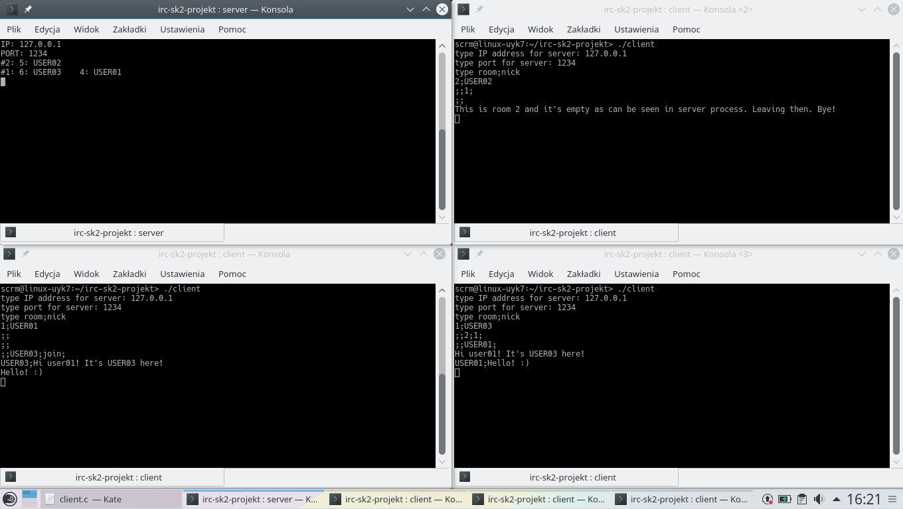

# TCP Internet Relay Chat

University project for "Computer Networks". Concurrent TCP server and client implementation for commonly known Internet Relay Chat application written in C using BSD Sockets API and POSIX Threads. It enables group communication over the Internet with specified server IP and port number.

Task description in file "zasady_projektow.pdf".

### Prerequisites

* Linux OS (with BSD Sockets API and pthread library)

### Compiling

```
gcc -Wall -pthread server.c -o server
gcc -Wall -pthread client.c -o client
```
### Running

| Server | Client |
| --- | --- |
| Type ./server in command line | Type ./client in command line |
| Type IP (e.g. 127.0.0.1) | Type server IP (e.g. 127.0.0.1) |
| Type Port number (e.g. 1234) | Type server Port number (e.g. 1234) |
| | Type your room and nickname (e.g. 1;user01) |
| | Write messages to others. |

### Screenshots


